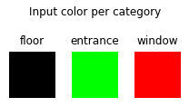
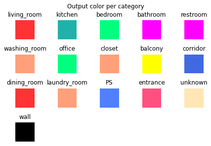
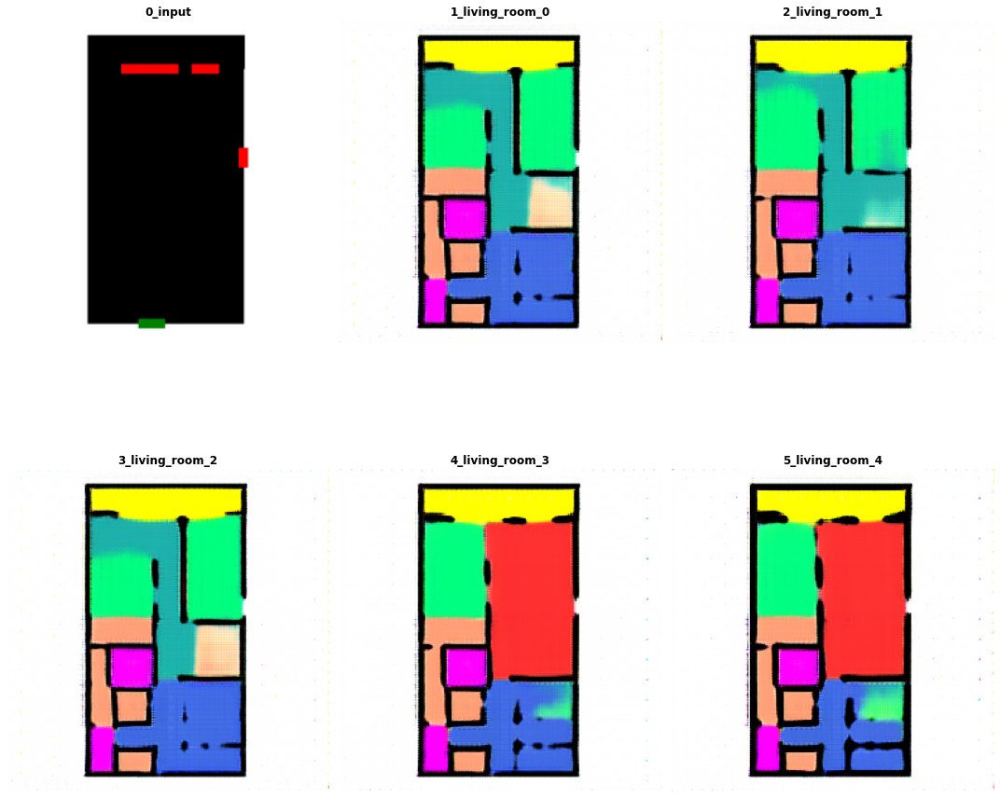

# fml-wright

Fml wright is a personal project of mine, Sebastiaan Grasdijk, where I attempt to build on the
 great work that Stanislas Chaillou has done. His work can be found here: http://stanislaschaillou.com/expliquer/ .
My extension on his work is that where he used `Pix2Pix`, a one-to-one mapping model, whereas I'm
 using `BiCycleGan`, a one-to-many mapping model. This means that with a single model, multiple floorplans are generated.

The core idea of this project is to dynamically create floorplans using generative adversial
 networks (GAN). The networks generate floorplans examples based on input by a user. The user
  would be able to make adjustments and then move through various stages of floorplan design.

The dataset process is split into several steps:
* `dataset_generators.generate_geodataframe_file` creates geodataframe from the txt files dataset.
* `dataset_generators.groundplan` module creates ground plan images.
* `dataset_generators.ImageFloorplanGenerator` creates floor plan images.
* `dataset_generators.ImageStructureGenerator` module creates structure images.

`ImageFloorplanGenerator` and `ImageStructureGenerator` can also be done as a single step, this
 is done with the following generator:
* `dataset_generators.ImageSingleStepGenerator`

The modeling process is split several generation steps:
* Ground plan

* Single step generator

or
* Floor plan
* Structure plan

Finally the `DatasetGenerator` is used to turn the images into a `.tfrecords` dataset.

### About the models

The plans are generated using a combination of keras and tensorflow implementations of
 BiCycleGan or Pix2Pix
 models.
The original implementations can be found here:
* Pix2Pix: https://github.com/junyanz/pytorch-CycleGAN-and-pix2pix
* BiCycleGan: https://github.com/junyanz/BicycleGAN.

Models can be trained per category or for all categories at the same time.

Finally, the generated floorplans can be quantified using several pre-defined metrics.

The original idea was to use as much `Keras` as possible, however I ran into issues with
 trainable weights for the Discriminator and Encoder. It was easier to move in a more tensorflow
  oriented direction.

## Examples
#### Color legend
Below are the input colors and their meanings.


These are the output colors and their meanings:


###  Singlestep generation
This model generates the entire floorplan in a single step, creating both the rooms and walls at
 the same time.

 In the example below, the top left image is the input of the GAN, and the other five floorplans
  are generated examples.


#### Processing example
The images are transformed from an image to a geodataframe, meaning that the rooms and
 walls become separate mutatable entities.


## Usage
Most of the usage of the repository is done using scripts. The `main` directory contains entry
 points to generate datasets and train the models.

### Main
Main contains the entry points for dataset generation and model training.

#### `main_core`
This script has the entry points to create the datasets required for the neural networks. The
 order is as follows:

 1) Generate the geojson file using `generate_geodataframe_file`.
 2) Generate images using generators such as `ImageFloorplanGenerator`.
 3) Combine and resize the generated images with `DatasetGenerator`.

This will create a dataset with images for all possible categories. Selection of the data is done
 within the neural network trainer. Images can be in multiple categories, so generating the
  dataset subset in the trainer saves space.

#### `main_neural_network`
This script starts the neural network trainer. The neural networks are based on the configuration
 files, which can be found in the `config` folder. Loading the data and initalizing the models is
  done in the `modeling.train` script.

 It is also possible to overwrite the config category using arguments. This can be done as follows:

 ```shell script
python ./main/main_neural_network.py --config=./config/config_nn_floor_plan.yaml  --category=single_bedroom
```

It will overwrite the category in the config file `config_nn_floor_plan` to use a `single_bedroom
` category.

### Bash scripts
In order to make the repository easy to use, bash scripts have been created. The bash script
 names are hopefully fairly self explanatory. They can be used as followed:

```shell script
bash scripts/5_train_floorplan_nn.sh
```
This will start training a neural network to create floorplans for a category that is defined in
 the configuration file.

## Installation
```shell script
conda env create -f environment.yml
conda activate fml-wright
pip install -e .
```

## Repository structure
```shell script
fmlwright
├── __init__.py
├── core
│   ├── data_sources
│   ├── labeling
│   ├── metrics
│   ├── postprocessing
│   ├── preprocessing
│   └── utils
├── dataset_generators
└── trainer
    ├── models
    ├── neural_networks
    ├── generator
    └── run.py
```
The `fmlwright` package is split in three modules: `core`, `dataset_generators` and `modeling`.
* `core` contains general functions needed to do perform things such as data ingestion
, preprocessing etcetera.
* `dataset_generators` contain the generators to build the datasets in various stages.
* `modeling` contains the deep learning aspect of this repository.
    * `neural_networks` contain some neural networks and building blocks for the neural networks.
    * `modeling`: models such as `BiCycleGAN` and `Pix2Pix` can be found here.
    * `predictor`: predictors that load the various models and provide an interface to make it
     easier to predict images of different categories.

## Data sources
### Ground plans
The ground plans are retrieved using a bag/kadastar crawler for the dutch open-source kadastar data.

### Floor plans
This data originates from the repository: https://github.com/art-programmer/FloorplanTransformation.

It is housing layout information, such as rooms where the living room, kitchen and other rooms are.

# Future work
A number of functions in this project was done under the motto of 'make it work, make it right, make
 it fast.'. As can be imagined, not all of the code got to the final stage.

Please see the projects page for future work.
